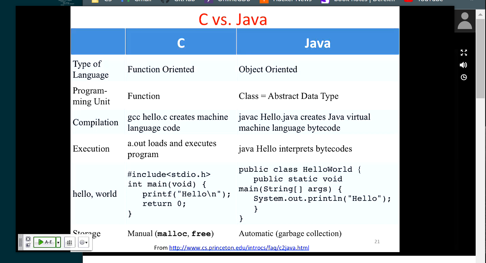

# CS 61C: Great Ideas in Computer Architecture (LECTURE 2)
These notes are based on the Berkeley CS 61C course on computer architecture.

## CS history
- ENIAC was the first electronic general-purpose computer
    - No moving parts
    - Was hard to program, had to do everything manually
    - Used to print artillery tables in World War 2; printer was super slow

- EDSAC was the first general stored-program computer
  - Based on von Neumann architecture, which wasn't really just von Neumann
  - Program is stored in memory

## Components of a computer
- Processor
    - Does things like add and subtract
    - Two parts: Control and Datapath
- Memory
    - Is a large array of bytes

- The processor reads memory
- Input and output changes what's in memory

- A program is really just a bunch of numbers in memory
    - The program is encoded into numbers, and the processor knows how to decode these numbers
    
## About C language
- C is a compiled language
- C is the lowest of all the high-level languages
    - It's called the "universal assembler" because it generates assembly code based on the machine you compile it on.
    - C isn't tied to any one machine's instruction set

- C is old, created in the 70s

- C is small, has very few keywords

- C was designed to make portable operating systems
    - Designed to run on different processors
    - It's the most popular low-level code choice

- C has maintained it's popularity

- C compilation generates binary (machine) code
- Java compilation creates machine-independent bytecode

- Compilation advantages
    - It makes a really fast program
- Compilation disadvantages
    - Compiled files are architecture-specific
    - The development/debugging process can be slow because changed files have to be recompiled every time in order to run properly

## The C preprocessor (CPP)
- The CPP changes the program code before compilation
  - Removes comments
  - Inserts (includes) files into code
- The CPP uses # symbol and <> brackets
- You can define constants like this: `#define PI 3.14`
- #if/#endif conditionally includes code
- The -save-temps option in GCC shows what cpp creates

## C vs. Java

## C Language Details
- C data types
    - int
    - float
    - char
    - unsigned
    - long
    - double

- C `const` keyword
    - The value of a `const` variable doesnt change
    - Acts in exactly the same way as `#define`
    - It's a newer concept in C

- The C keyword `enum` allows you to associate integer constants with symbols
  - `enum weekdays{MON, TUES, WEDS, THURS, FRI}`
  - `MON` = 0, `TUES` = 1, and so on...

- When a C program runs:
    - The executable is loaded into memory by the OS
    - The OS sets up a program stack
    - The runtime sets up memory and does other stuff.

- C has no explicit boolean
    - 0 evaluates to false
    - `NULL` keyword evaluates to false
    - True is anything that isn't 0 or `NULL`

## Addresses vs Values
- Computers use unsigned numbers for memory addresses
- Addresses represent the location in memory where variable vaules are stored.

